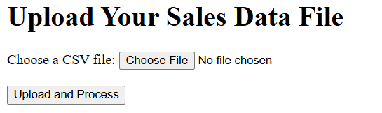
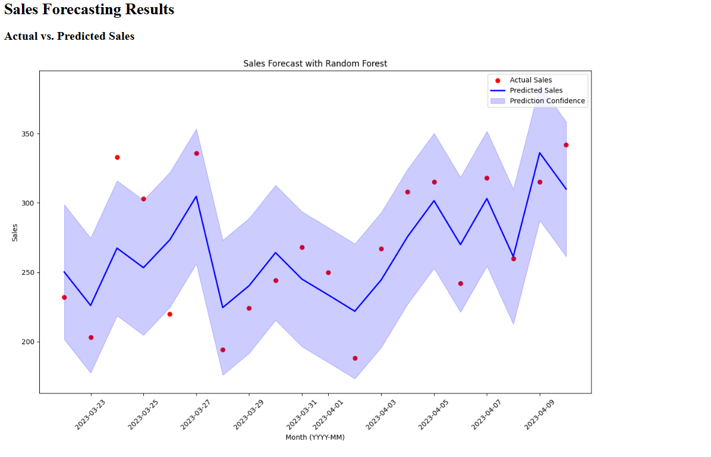
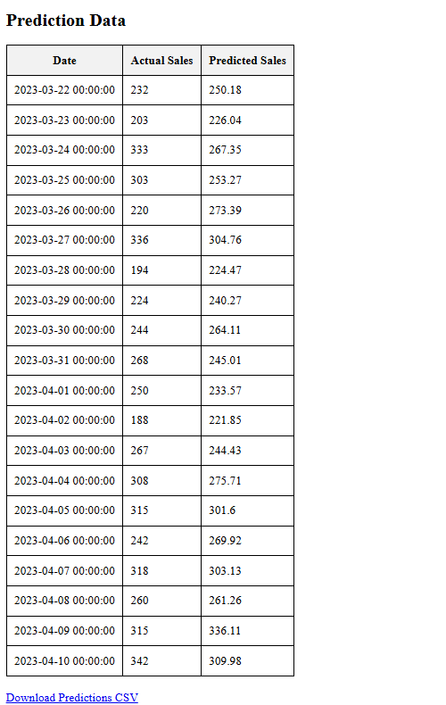

---

# Sales Forecasting Project

This project is a web-based application that uses machine learning to forecast sales based on historical data. The interface allows users to upload a CSV file with sales data, processes the data, trains a machine learning model, and visualizes the predicted sales. The results, including graphs and predictions, are displayed on the web interface and available for download.

## **Features**

- Load sales data from a CSV file.
- Feature engineering to extract relevant features for time-series prediction.
- Model training using a pipeline with scaling and Random Forest Regressor.
- Predictions of future sales.
- Visualization of actual vs. predicted sales.
- Confidence intervals for predictions.
- Downloadable CSV with predictions.

## **Tech Stack**

- **Backend**: Python, Flask
- **Machine Learning**: Scikit-Learn, Pandas, NumPy
- **Visualization**: Matplotlib
- **Frontend**: HTML

## **Setup Instructions**

### **Prerequisites**

Make sure you have the following installed:

- [Python 3.8+](https://www.python.org/downloads/)
- [pip](https://pip.pypa.io/en/stable/installation/)

### **Step-by-Step Guide**

1. **Clone the Repository**:
   ```bash
   git clone https://github.com/yourusername/sales-forecasting.git
   cd sales-forecasting
   ```

2. **Create and Activate a Virtual Environment**:
   ```bash
   python -m venv venv
   source venv/bin/activate        # On Windows: venv\Scripts\activate
   ```

3. **Install Dependencies**:
   ```bash
   pip install -r requirements.txt
   ```

### **How to Run the Project**

1. **Start the Flask Application**:
   
   In the project root directory, run the following command:
   
   ```bash
   python app.py
   ```

   This will start the Flask development server.

2. **Open the Web Interface**:
   
   Open your web browser and go to the following URL:
   
   ```
   http://127.0.0.1:5000
   ```

3. **Upload a CSV File**:

   - On the home page, upload a CSV file with the following format:

     ```
     Date,Sales
     2023-01-01,200
     2023-02-01,150
     2023-03-01,180
     ```
   
   - `Date`: The date in `YYYY-MM-DD` format.
   - `Sales`: The sales value for that date.

4. **View Predictions**:

   - Click the "Submit" button to process the file.
   - The application will display a graph comparing actual vs. predicted sales and the prediction metrics (MSE, MAE, R² score).

5. **Download Predictions**:

   - A link to download the CSV file with the predicted sales will be available on the results page.

### **Project Structure**

```
sales-forecasting/
├── app.py               # Flask application (web interface)
├── main.py              # Core logic for data processing and model training
├── requirements.txt     # Python dependencies
├── static/
│   ├── images/          # Folder for saved images (graphs)
│   └── uploads/         # Folder for uploaded CSV files
├── templates/
│   ├── index.html       # Main upload page template
│   └── results.html     # Results display page template
└── README.md            # Project documentation
```

## **Machine Learning Approach**

- **Model**: Random Forest Regressor, used for capturing non-linear patterns in time-series data.
- **Pipeline**:
  - **Scaling**: Normalizes input features using `StandardScaler`.
  - **Regression**: Random Forest Regressor with 100 estimators.

### **Feature Engineering**
- **Time Features**: Month, Year, Day of the Year.
- **Lag Features**: Sales data from previous months.
- **Rolling Mean**: 3-month rolling average for trend analysis.

## **Visualization**

The application uses Matplotlib to visualize sales predictions:
- **Actual Sales** (in red).
- **Predicted Sales** (in blue).
- **Confidence Interval**: The shaded area shows the prediction confidence.

## **Screenshots**

### **Home Page**


### **Prediction Results**



## **Future Enhancements**

- Add support for additional file formats like Excel.
- Allow model selection (Linear Regression, XGBoost, etc.).
- Implement a more advanced hyperparameter tuning mechanism.
- Extend visualization options for better insights.

## **Contributing**

Contributions are welcome! Please follow these steps:

1. **Fork the repository**.
2. **Create a branch** for your feature (`git checkout -b feature-name`).
3. **Commit your changes** (`git commit -m 'Add some feature'`).
4. **Push to the branch** (`git push origin feature-name`).
5. **Create a Pull Request**.

## **License**

This project is open-source and available under the [MIT License](LICENSE).

## **Contact**

For any inquiries, feel free to reach out:

- **Email**: dv30arya@gmail.com
---